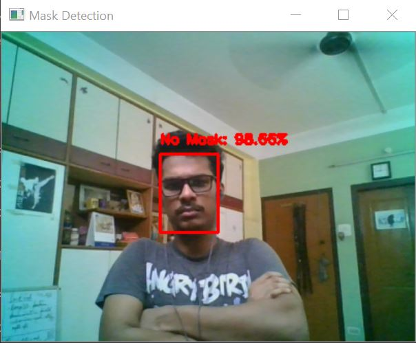
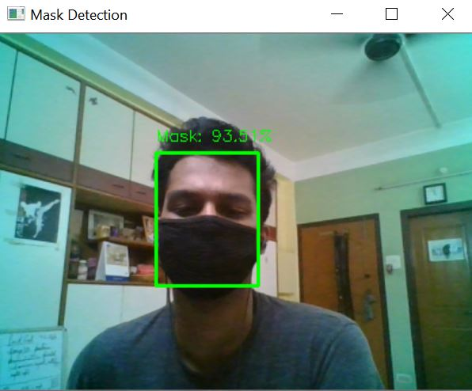

# Mask-Detection

[](http://makeapullrequest.com)
[](https://gitpod.io/from-referrer/)


[](https://github.com/ellerbrock/open-source-badges/)

Mask Detection Program using Tensorflow, Keras and OpenCV. The Base Model being used here is `ResNet10`.

## About

It is a Mask Detection Program to make people aware for wearing masks and protect themselves during the Corona pandemic.

## Output

Without Mask @400p : <br>
 
<br><br>
With Mask @400p : <br>
 <br>

Sample Output 1 : <br>
 <br>

Sample Output 2 : <br>
 <br>

Sample Output 3 : <br>
 <br>

All the section wise output files according to sections are in `/output`.

## Dependencies 

Install the dependencies from your terminal with -

`pip install -r requirements.txt`

## Run 

Run the Mask-Detector from your terminal with -

`python detectMaskLive.py`

## Building the Model

*** <b>Model Training</b> ***

1. Firstly we need to create a Neural Network to classify the frames as positive/negative (Wearing a Mask or not).
2. We train a model using `ResNet10` as the BaseModel and perform Data Augmentation to get more images from the given `/dataset`.
3. After creation of the NN we train the model with some given pre-defined hyperparamters. After which we get something like this -
```
*** Loading Models ***
*** Compiling our Model ***
*** Training our Model ***
Epoch 1/20
 1/34 [..............................] - ETA: 0s - loss: 1.1101 - accuracy: 0.46882020-07-11 21:35:10.388733: W tensorflow/core/framework/cpu_allocator_impl.cc:81] Allocation of 154140672 exceeds 10% of free system memory.
 2/34 [>.............................] - ETA: 15s - loss: 1.0499 - accuracy: 0.51562020-07-11 21:35:11.391032: W tensorflow/core/framework/cpu_allocator_impl.cc:81] Allocation of 154140672 exceeds 10% of free system memory.
34/34 [==============================] - 49s 1s/step - loss: 0.4660 - accuracy: 0.7940 - val_loss: 0.1289 - val_accuracy: 0.9819
Epoch 2/20
34/34 [==============================] - 52s 2s/step - loss: 0.1274 - accuracy: 0.9579 - val_loss: 0.0597 - val_accuracy: 0.9855
Epoch 3/20
34/34 [==============================] - 51s 1s/step - loss: 0.0742 - accuracy: 0.9794 - val_loss: 0.0443 - val_accuracy: 0.9855
Epoch 4/20
34/34 [==============================] - 51s 1s/step - loss: 0.0606 - accuracy: 0.9785 - val_loss: 0.0328 - val_accuracy: 0.9928
Epoch 5/20
34/34 [==============================] - 48s 1s/step - loss: 0.0449 - accuracy: 0.9888 - val_loss: 0.0292 - val_accuracy: 0.9891
Epoch 6/20
34/34 [==============================] - 51s 1s/step - loss: 0.0351 - accuracy: 0.9860 - val_loss: 0.0267 - val_accuracy: 0.9928
Epoch 7/20
34/34 [==============================] - 52s 2s/step - loss: 0.0333 - accuracy: 0.9888 - val_loss: 0.0250 - val_accuracy: 0.9928
Epoch 8/20
34/34 [==============================] - 51s 2s/step - loss: 0.0293 - accuracy: 0.9925 - val_loss: 0.0206 - val_accuracy: 0.9928
Epoch 9/20
34/34 [==============================] - 49s 1s/step - loss: 0.0295 - accuracy: 0.9899 - val_loss: 0.0240 - val_accuracy: 0.9928
Epoch 10/20
34/34 [==============================] - 49s 1s/step - loss: 0.0224 - accuracy: 0.9925 - val_loss: 0.0217 - val_accuracy: 0.9928
Epoch 11/20
34/34 [==============================] - 50s 1s/step - loss: 0.0200 - accuracy: 0.9934 - val_loss: 0.0199 - val_accuracy: 0.9928
Epoch 12/20
34/34 [==============================] - 50s 1s/step - loss: 0.0245 - accuracy: 0.9934 - val_loss: 0.0205 - val_accuracy: 0.9928
Epoch 13/20
34/34 [==============================] - 49s 1s/step - loss: 0.0200 - accuracy: 0.9925 - val_loss: 0.0197 - val_accuracy: 0.9928
Epoch 14/20
34/34 [==============================] - 47s 1s/step - loss: 0.0165 - accuracy: 0.9944 - val_loss: 0.0173 - val_accuracy: 0.9928
Epoch 15/20
34/34 [==============================] - 41s 1s/step - loss: 0.0156 - accuracy: 0.9963 - val_loss: 0.0176 - val_accuracy: 0.9928
Epoch 16/20
34/34 [==============================] - 40s 1s/step - loss: 0.0151 - accuracy: 0.9972 - val_loss: 0.0150 - val_accuracy: 0.9964
Epoch 17/20
34/34 [==============================] - 41s 1s/step - loss: 0.0118 - accuracy: 0.9981 - val_loss: 0.0147 - val_accuracy: 0.9928
Epoch 18/20
34/34 [==============================] - 41s 1s/step - loss: 0.0121 - accuracy: 0.9972 - val_loss: 0.0155 - val_accuracy: 0.9928
Epoch 19/20
34/34 [==============================] - 40s 1s/step - loss: 0.0113 - accuracy: 0.9972 - val_loss: 0.0135 - val_accuracy: 0.9964
Epoch 20/20
34/34 [==============================] - 42s 1s/step - loss: 0.0063 - accuracy: 1.0000 - val_loss: 0.0163 - val_accuracy: 0.9928
*** Evaluting our NN ***
              precision    recall  f1-score   support

   with_mask       1.00      0.99      0.99       138
without_mask       0.99      1.00      0.99       138

    accuracy                           0.99       276
   macro avg       0.99      0.99      0.99       276
weighted avg       0.99      0.99      0.99       276

*** Saving Mask-Detector Model ***
```
4. Now our Model has been saved as `maskDetector.model` which is a `h5` type file.  <br>
5. All the above steps can be performed by running `python trainMaskDetector.py -d ./dataset` in terminal or by coding from scratch as instructed above. <br>

*** <b>Testing out the Model using Webcam</b> *** <br>
6. Now, that we've created our classification model we can directly apply it to live-feed video using `opencv`.  <br>
7. Desgin Bounding Box, Texts and etc if needed.  <br>
8. Run `python detectMaskLive` to start the webcam and check whether *You're Wearing a Mask or Not!*. Running the command shows up something like this - 
```
***** Loading FaceDetector *****
***** Loading FaceMask Detector *****

------------- Starting Video Stream -------------
------------- Video Stream Stopped -------------
```

## Next Updates 

| To Do                     |
|---------------------------|
| 1. Improve Accuracy       |
| 2. Improve Latency Time   |

NOTE : It's noted that increasing the frame window aspect ratio decreases the model accuracy. 

## Contributing [](https://github.com/dwyl/esta/issues)

If you are the helping and contributing one, your efforts and suggestion are always welcomed.

## Reference(s)

1.  [PyImageSearch](https://www.pyimagesearch.com/2020/05/04/covid-19-face-mask-detector-with-opencv-keras-tensorflow-and-deep-learning/)
2.  [Datasets](https://github.com/prajnasb/observations/tree/master/mask_classifier/Data_Generator)

<br>

[](https://www.python.org/)
[](https://GitHub.com/rahulbordoloi/)
